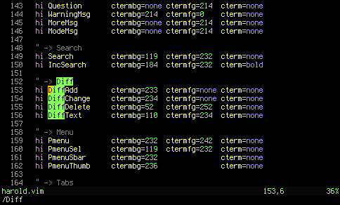
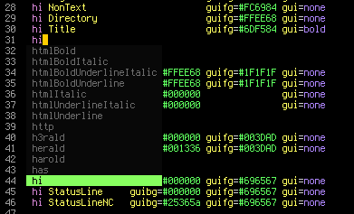

# vim-colors-harold

A colorscheme for vim, based on Fabio Cevasco's [herald.vim](http://h3rald.com/herald-vim-color-scheme/).

## Differences with herald.vim

* Plain black background (or terminal background color) instead of dark gray
* Greenish completion menu, status line, visual mode selection and 'insearch' highlighting
* Edited diff colors

## Obligatory screenshots:

